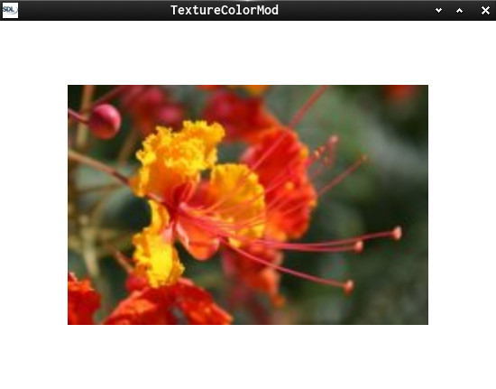
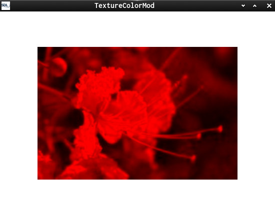

This is a small SDL2 demo to show how to use

 * [TextureColorMod](https://wiki.libsdl.org/SDL_GetTextureColorMod?action=fullsearch&context=180&value=TextureColorMod&titlesearch=Titles)

RMB reset colors  
LMB sets a few values - log in console

Useful links:  
[SDL2](https://www.libsdl.org/) [SDL-Discourse](https://discourse.libsdl.org) [More Example Code](https://acry.github.io/SDL2-C.html)

Screenshot:  
  
  

Assets  
gfx/flower.png  
taken from <http://lodev.org/cgtutor/color.html>

[Get in touch on SDL-Discourse](https://discourse.libsdl.org/u/Acry/summary)
